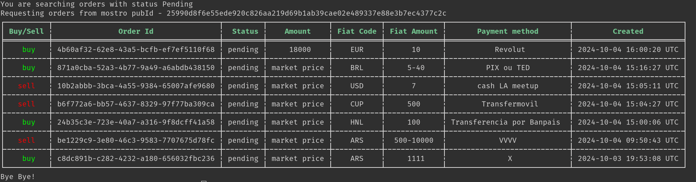

# Mostro CLI

Mostro CLI is a Mostro client with a command-line interface. It is primarily used by developers and advanced users to test the latest Mostro features and to automate operations.



## Installation

You can install Mostro CLI directly from crates.io:

```bash
cargo install mostro-cli
```

Or build it manually:

```bash
git clone https://github.com/MostroP2P/mostro-cli.git
cd mostro-cli
cargo build --release
```

Requirements: Rust 1.64 or higher.

## Features

- Create buy and sell orders
- Take orders from the order book
- Support for range orders (min-max)
- Create buy orders with Lightning Address
- Direct chat with counterparties (NIP-17)
- Identity management (NIP-06 support)
- Full dispute flow
- Restore session to recover pending orders
- Administration commands for Mostro operators

## Basic Usage

```bash
# Set environment variables
export MOSTRO_PUBKEY=npub1stagewtcks78nvs4vkzm4skqzytk5gwj46kkm8mu2awqqklgswgqfvtamr
export RELAYS='wss://relay.mostro.network,wss://nos.lol'

# List available orders
mostro-cli listorders

# Create a buy order
mostro-cli neworder -k buy -c ves -f 1000 -m "face to face"

# Create a sell order with a range
mostro-cli neworder -k sell -c ars -f 1000-10000 -m "bank transfer"

# Cancel a pending order
mostro-cli cancel -o <order-id>

# Restore session
mostro-cli restore
```

To see all available commands:

```bash
mostro-cli help
```

## More Information

Mostro CLI is a FOSS project. You can visit its [GitHub repository](https://github.com/MostroP2P/mostro-cli) to learn more about its development, report bugs, or propose improvements.
